## Part 1. Installation of the OS
- Check Ubuntu version by running the command `cat /etc/issue`  
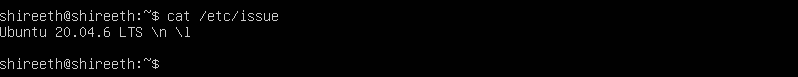

## Part 2. Creating a user
- 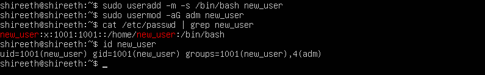

## Part 3. Setting up the OS network
- <b> 1. Set the machine name as user-1:</b>   
- 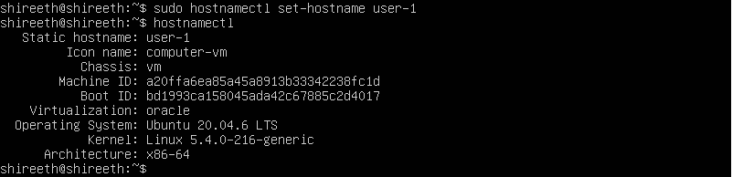
- after reboot
- 

- <b> 2. Set the time zone corresponding to your current location:</b>   
- 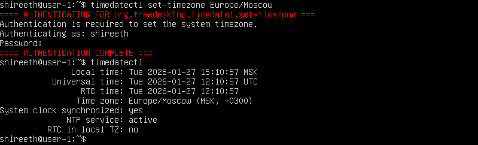

- <b> 3. Output the names of the network interfaces using a console command:</b>   
- 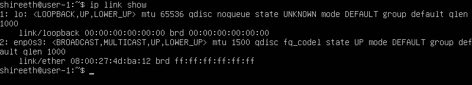
- lo interface - The Loopback interface (also known as the loopback interface) is a virtual network interface used for testing and managing network equipment, as well as as an address source for some network protocols.

- <b> 4. Use the console command to get the ip address of the device you are working on from the DHCP server.</b>   
- 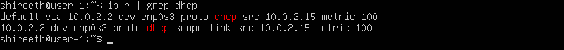
- In VirtualBox, the default NAT network configuration uses 10.0.2.2 as the host IP address and 10.0.2.x (where 2<"x"<255) for the virtual machine IP addresses. Therefore, whenever virtual machines are launched, you can use 10.0.2.2 to designate "my machine."

- <b> 5. Define and display the external ip address of the gateway (ip) and the internal IP address of the gateway, aka default ip address (gw).</b>   
- External 
- 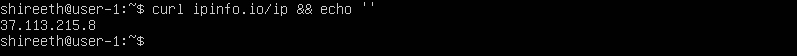 
- Internal 
- 

- <b> 6. Set static (manually set, not received from DHCP server) ip, gw, dns settings (use public DNS servers, e.g. 1.1.1.1 or 8.8.8.8).</b> </b>   
- Make a copy of the existing  
- 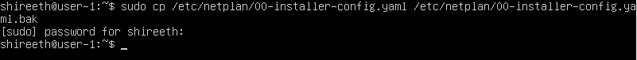
- Edit config  
- 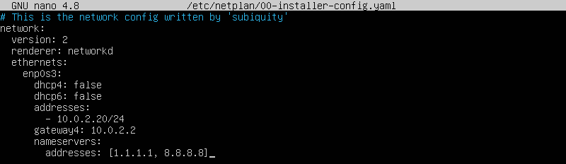
- Turn off ipv6 by adding 2 last rows  
- 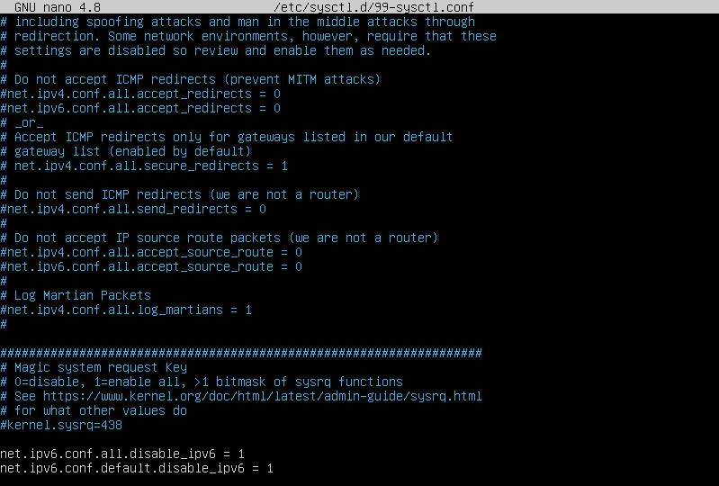
- Check changes  
- 
- Ping  
- 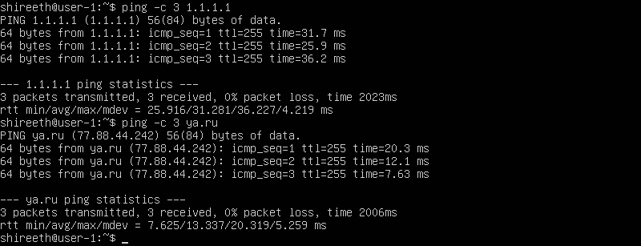

## Part 4. OS Update
- Start update  
- 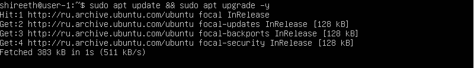
- Finish update  
- 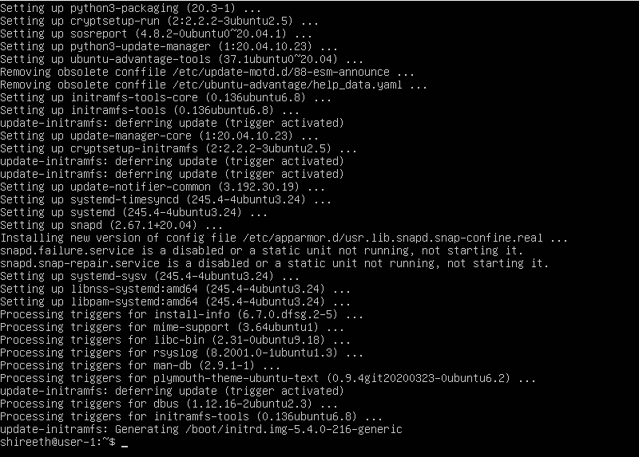
- Chechk update  
- 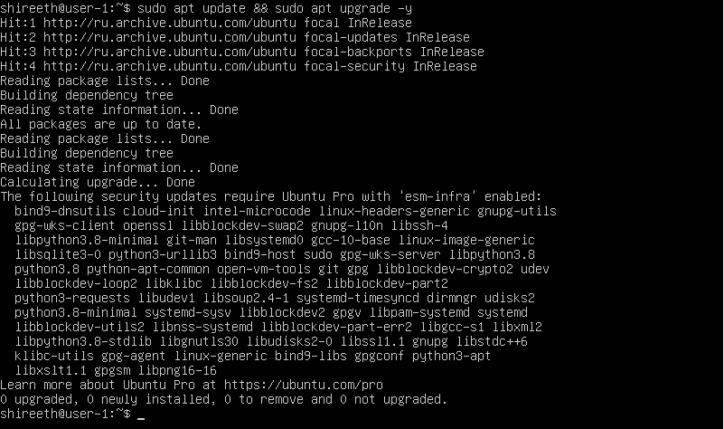

## Part 5. Using the **sudo** command
- Add user to sudo group  
- 
- Login new_user  
- 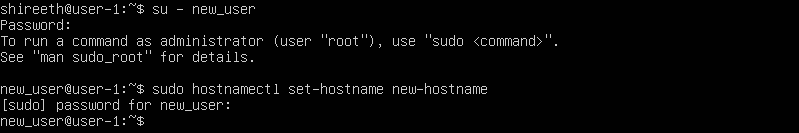
- Change hostname 127.0.1.1 to new-hostname (symb _ is forbiden in name)  
- 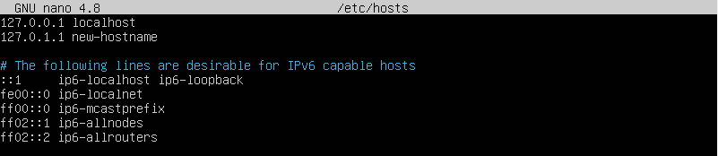
- After reboot  
- 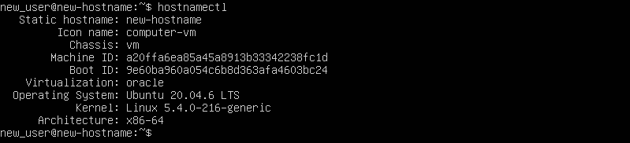
- The sudo command in Ubuntu, as in other Linux systems, allows users to execute commands with elevated privileges, typically superuser (root) rights. This allows a regular user to temporarily gain administrator privileges to perform certain tasks without having to permanently log in as root.

## Part 6. Installing and configuring the time service
- Timezone  
- 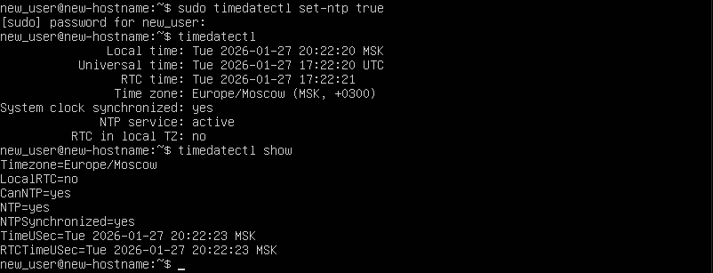

## Part 7. Installing and using text editors
- <b> 1. Using each of the three selected editors, create a test_X.txt file, where X is the name of the editor in which the file is created. Write your nickname in it, close the file and save the changes.</b>

1. vim
   1. vim test_VIM.txt
   2. i
   3. ESC
   4. :wq

2. nano
   1. nano test_NANO.txt
   2. ctrl+s
   3. ctrl+x

3. joe
   1. joe test_JOE.txt
   2. Ctrl+K X

- <b> 2. Using each of the three selected editors, open the file for editing, edit the file by replacing the nickname with the "21 School 21" string, close the file without saving the changes.</b>

1. vim
   1. vim test_VIM.txt
   2. i
   3. 21 School 21
   4. ESC
   5. :q!

2. nano
   1. nano test_NANO.txt
   2. 21 School 21
   3. ctrl+x n

3. joe
   1. joe test_JOE.txt
   2. 21 School 21
   3. Ctrl+K q n

- <b> 3. Using each of the three selected editors, edit the file again (similar to the previous point) and then master the functions of searching through the contents of a file (a word) and replacing a word with any other one.</b>

1. vim
   1. поиск
       1. vim test_VIM.txt
       2. i
       3. 21 School 21
       4. ESC
       5. /21 Enter n - next

   2. замена
       1. :s/21/word/g

2. nano
   1. поиск
       1. nano test_NANO.txt
       2. 21 School 21
       3. ctrl+w 21 enter alt+w - next

   2. замена
       1. ctrl+\ 21 enter word enter A

3. joe
   1. поиск
      1. joe test_JOE.txt
      2. 21 School 21
      3. Ctrl+K F 21 B

   2. замена
      1. Ctrl+K F 21 R word R

## Part 8. Installing and basic setup of the **SSHD** service
- <b> 1. Install the SSHd service.</b>
- Install  
- 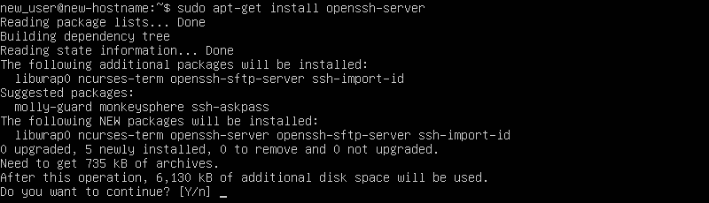

- <b> 2. Add an auto-start of the service whenever the system boots.</b>
- 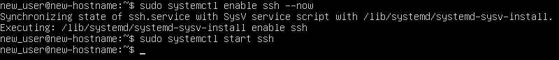

- <b> 3. Reset the SSHd service to port 2022.</b>
- Add Port 2022 after #Port 22  
- 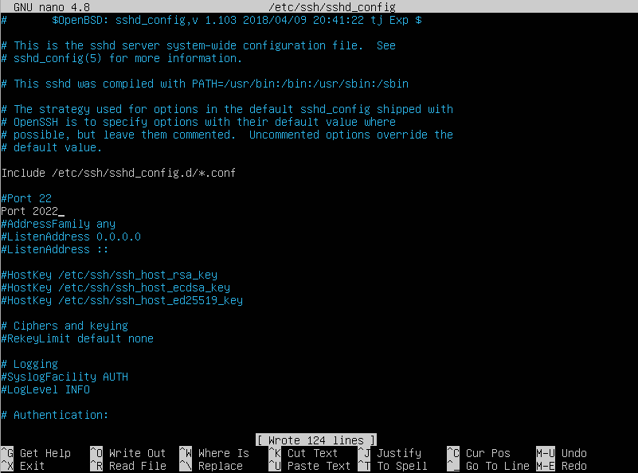
- Restart  
- 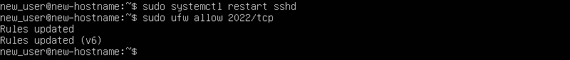

- <b> Show the presence of the sshd process using the ps command. To do this, you need to match the keys to the command.</b>
- 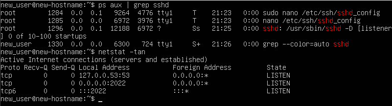
- ps aux | grep '[s]shd'. It consists of two parts connected by the | (pipe) symbol, which passes the output of the first command as input to the second. The ps aux command lists all processes on the system with detailed information. When we pipe the output of ps aux through grep sshd, we get only those lines containing the word sshd.

- <b> 5. Reboot the system</b>

- <b> Explain the meaning of the -tan keys, the value of each output column, the value 0.0.0.0. in the report.</b>

- The netstat command is used to display network connections, routing tables, interface statistics, and other network data.
  - In this case, it shows active TCP connections.
  - t — Displays only TCP connections.
  - a — Displays all active connections and listening ports (that is, both established connections and those listening for incoming connections).
  - n — Displays addresses and port numbers as numbers, without attempting to convert them to names (e.g., IP addresses instead of domain names, port numbers instead of service names).

- Explanation of columns:
  - Proto — protocol (here, TCP)
  - Recv-Q — number of bytes in the receive queue
  - Send-Q — number of bytes in the send queue
  - Local Address — local IP address and port
  - Foreign Address — remote IP address and port (or * if listening)
  - State — connection state (ESTABLISHED, LISTEN, CLOSE_WAIT, etc.)

- 0.0.0.0 "All IP addresses" or "listen on all interfaces"

## Part 9. Installing and using the **top**, **htop** utilities
- From the output of the top command determine and write in the report:
    - uptime 01:07
    - number of authorised users 1 
    - average system load 0
    - total number of processes 101
    - cpu load 0
    - memory load 151M
    - pid of the process with the highest memory usage 664
    - pid of the process taking the most CPU time 1283
- Add a screenshot of the htop command output to the report:
    - sorted by PID, PERCENT_CPU, PERCENT_MEM, TIME
    
    - 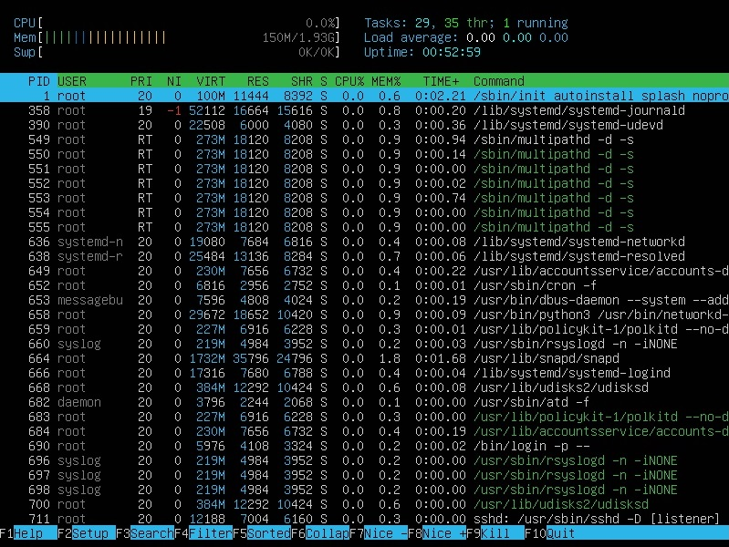
    - 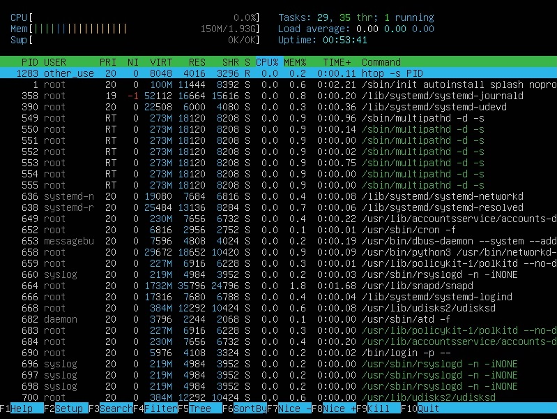
    - 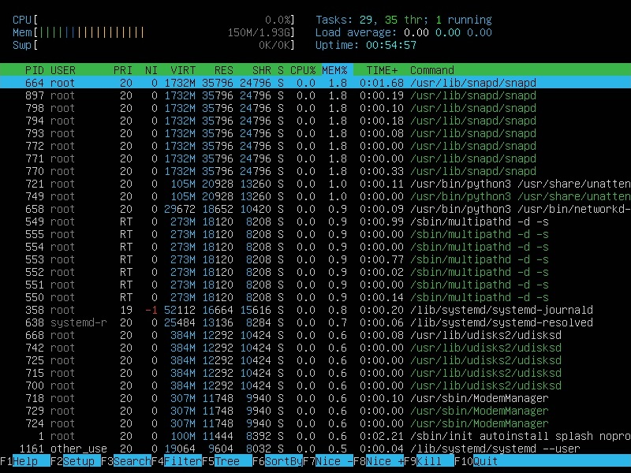
    - 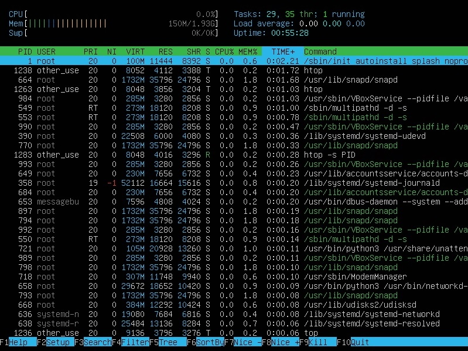
    
    - filtered for sshd process
    - 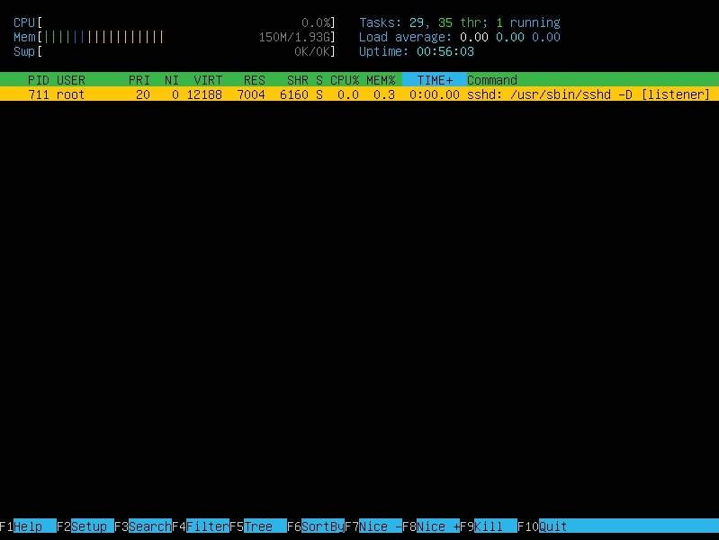

    - with the syslog process found by searching
    - 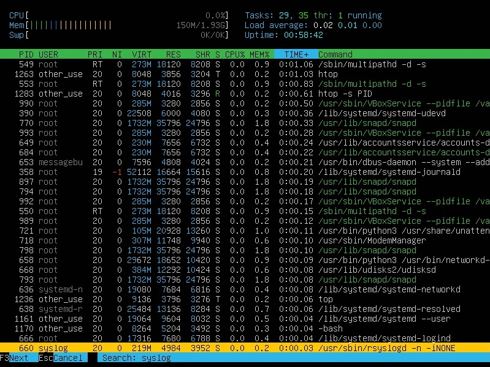

    - with hostname, clock and uptime output added
    - 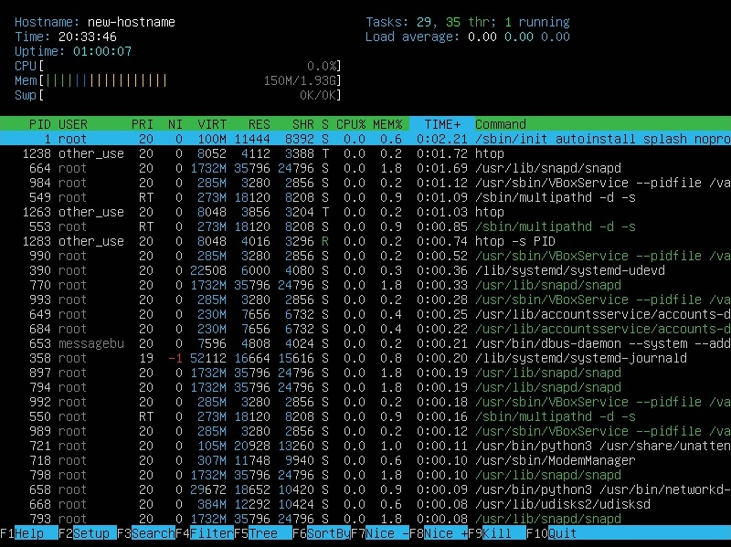
   
## Part 10. Using the **fdisk** utility
- 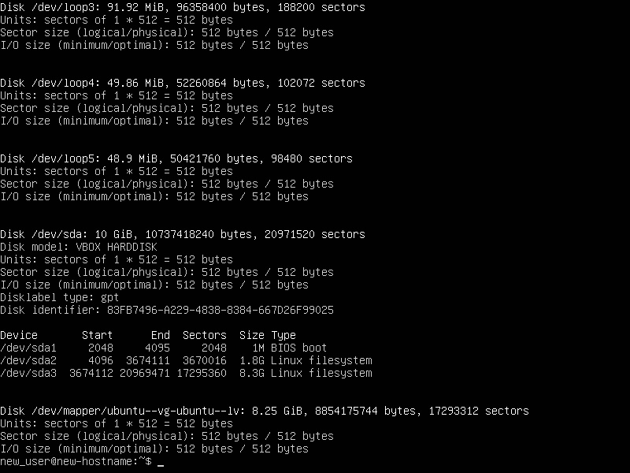
-  <b>In the report write:</b>
   -  the name of the hard disk - /dev/sda, 
   -  its capacity - 10GiB
   -  number of sectors - 20_971_520, 
   -  the swap size - (not avaliable) 0.

## Part 11. Using the **df** utility
- 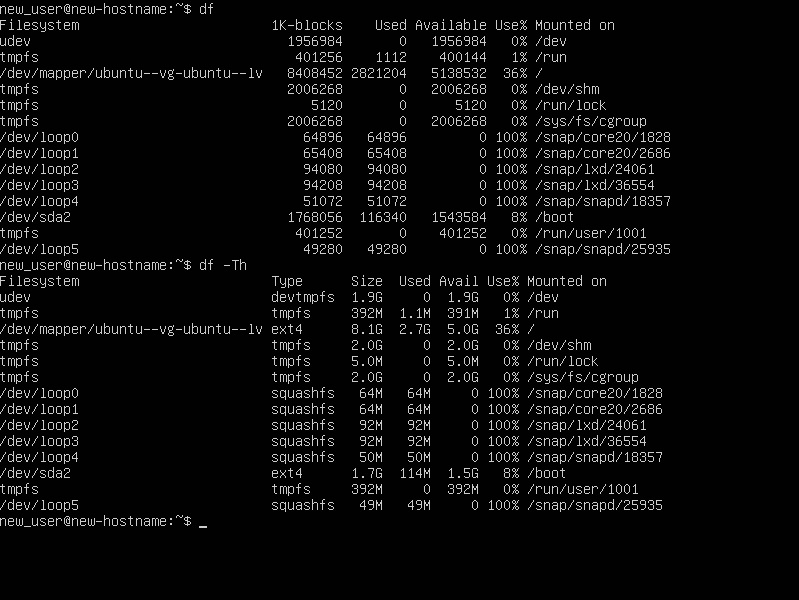
-  <b>Run the df.</b>
-  <b>In the report write for the root partition (/)</b>:
   -  partition size 8_408_452
   -  space used 2_821_204
   -  space free 5_138_532
   -  percentage used 36%
   -  Determine and write the measurement unit in the report - 1K-blocks (is the total space available, measured in 1kB units)

-  <b>Run the df -Th command.</b>
-  <b>In the report write for the root partition (/):</b>
   -  partition size 8.1G
   -  space used 2.7G
   -  space free 5G
   -  percentage used 36%
   -  Determine and write the file system type for the partition in the report - ext4 (fourth extended filesystem) is a journaling file system for Linux

## Part 12. Using the **du** utility
- 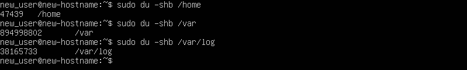
- 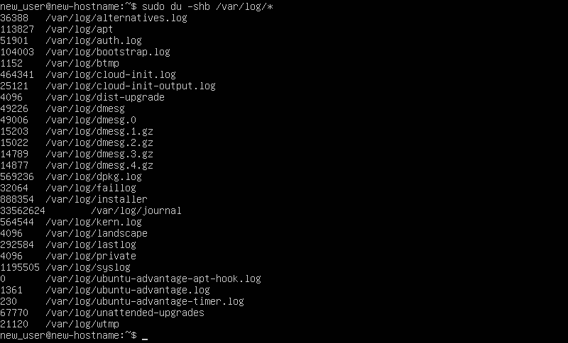

## Part 13. Installing and using the **ncdu** utility
- 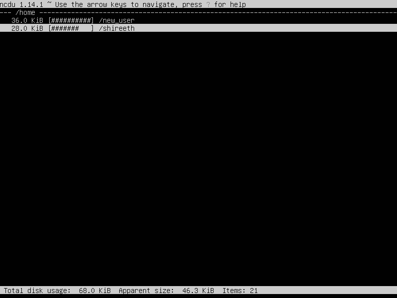
- 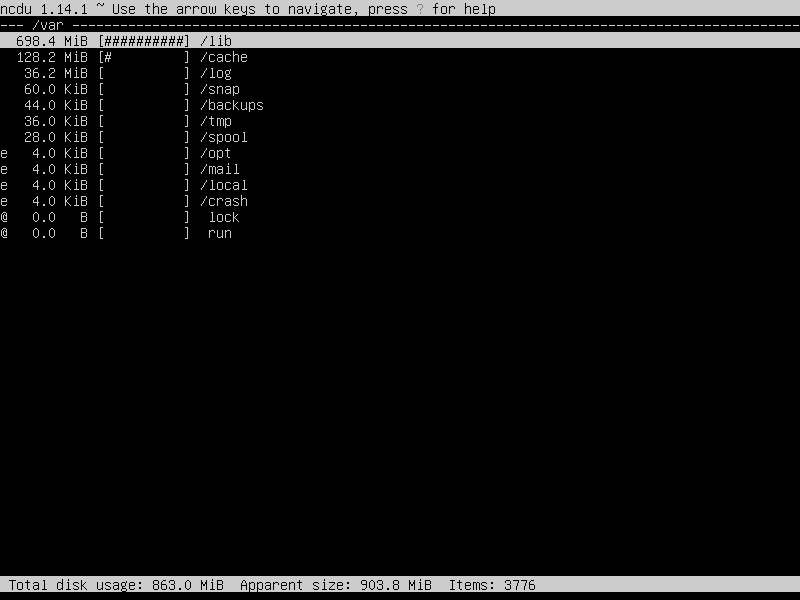
- 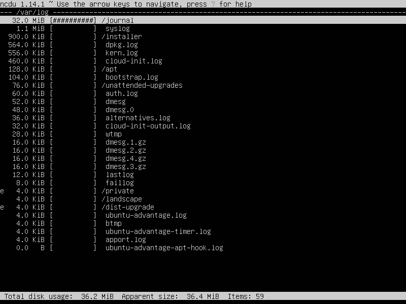

## Part 14. Working with system logs
-  <b>Open for viewing:</b>
   - use head or tail or less to view
   -  /var/log/dmesg
   - 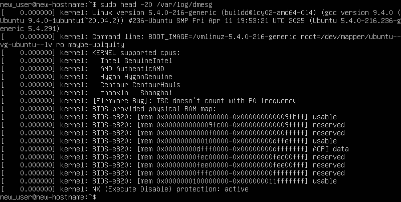

   -  /var/log/syslog
   - 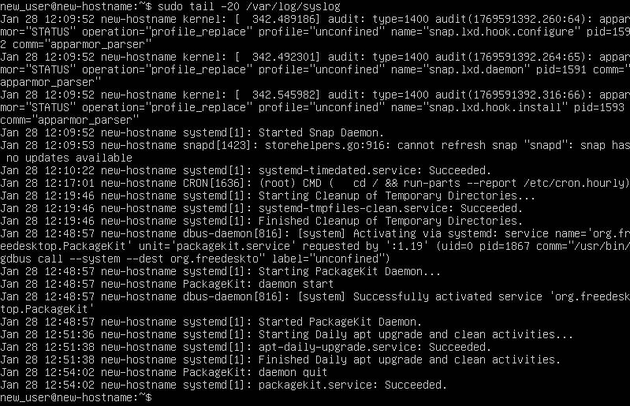

   -  /var/log/auth.log
   - 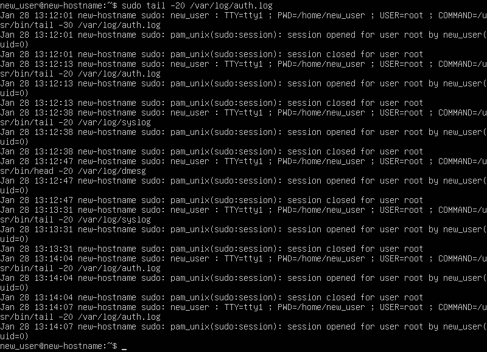

- Write the last successful 
   - 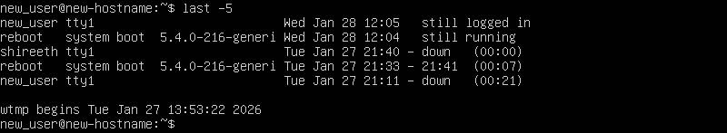
   - login time - 12:05
   - user name - new_user
   - login method - tty 

- Restart SSHd service;
- Add a screenshot of the service restart message to the report (search for it in the logs).
   - 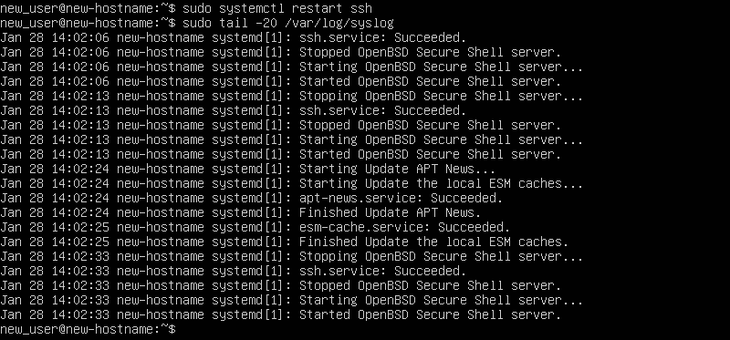

## Part 15. Using the **CRON** job scheduler
-  <b>Using the job scheduler, run the uptime command in every 2 minutes.</b>
   - 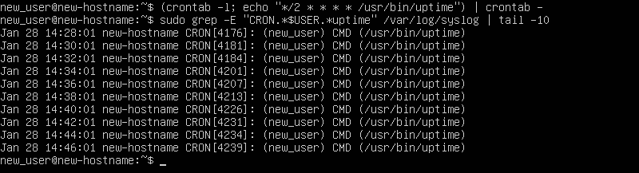
   - Find lines in the system logs (at least two within a given time range) about the execution;

-  <b>Display a list of current jobs for CRON.</b>
   - Remove all tasks from the job scheduler
   - Add a screenshot of the list of current tasks for CRON to the report.
   - 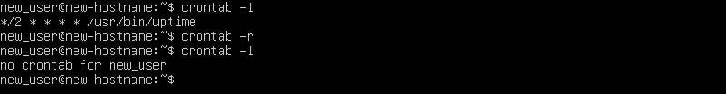
