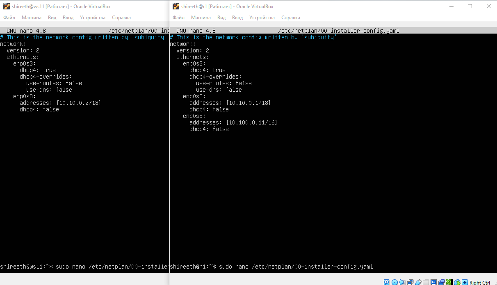
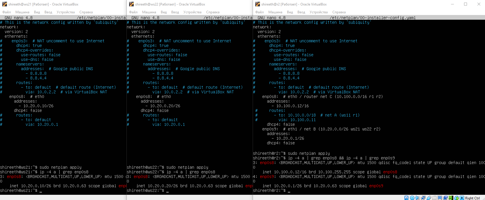
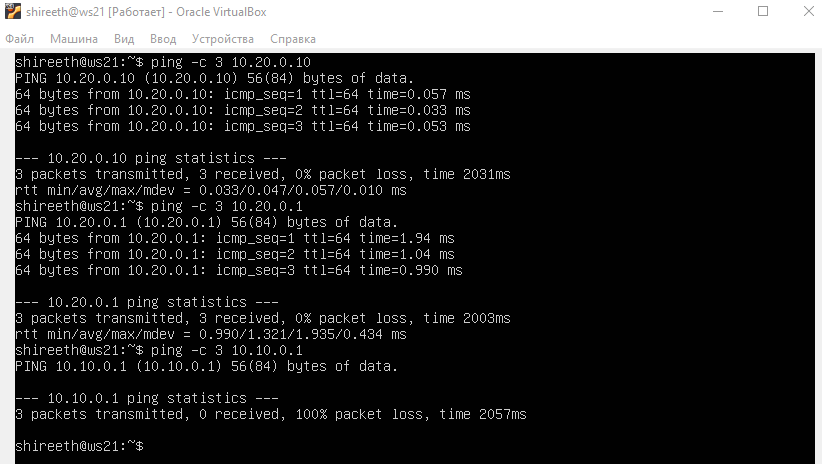
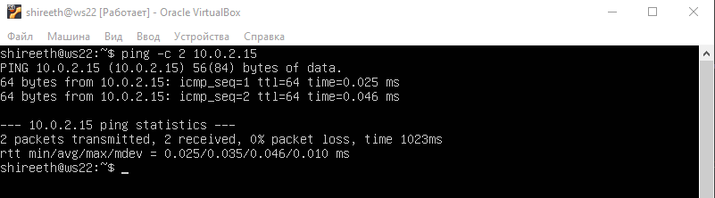
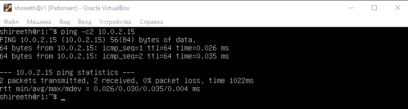
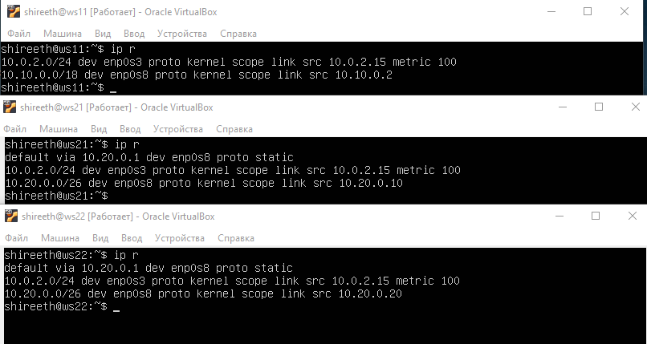

## Part 1. ipcalc tool

#### 1.1. Networks and Masks
- 1) network address of 192.167.38.54/13<br><br>
    - 192.160.0.0<br><br>
    <br><br>
- 2) conversion of the mask 255.255.255.0 to prefix and binary, /15 to normal and binary, 11111111.11111111.11111111.11110000 to normal and prefix<br><br>
        - 255.255.255.0 to prefix(CIDR) = /24<br><br>
        - 255.255.255.0 to binary = 11111111.11111111.11111111.00000000<br><br>
        <br><br>
        - /15 to normal (dotted decimal) = 255.254.0.0<br><br>
        - /15 to binary = 11111111.11111110.00000000.00000000<br><br>
        <br><br>
        - 11111111.11111111.11111111.11110000 to normal (dotted decimal) = 255.255.255.240<br><br>
        - 11111111.11111111.11111111.11110000 to prefix(CIDR) = /28<br><br>
        <br><br>
- 3) minimum and maximum host in 12.167.38.4 network with masks: /8, 11111111.11111111.00000000.00000000, 255.255.254.0 and /4<br><br>
    <br><br>

#### 1.2. localhost
-  Define and write in the report whether an application running on localhost can be accessed with the following IPs:<br><br>

    - 194.34.23.100 - NO,
    - 127.0.0.2 - YES (within the 127.0.0.0/8 range),
    - 127.1.0.1 - YES (within the 127.0.0.0/8 range),
    - 128.0.0.1 - NO.<br><br>
    - (* How it works: The operating system kernel recognizes any IP starting with 127 as a loopback address.<br> It immediately routes the network traffic back to the same machine without ever sending the packet to a physical or virtual network card.)

#### 1.3. Network ranges and segments
- 1) which of the listed IPs can be used as public and which only as private:<br><br>   
    - 10.0.0.45 - private (Class A private range 10.0.0.0/8), 
    - 134.43.0.2 - public, 
    - 192.168.4.2 - private (Class C private range 192.168.0.0/16),
    - 172.20.250.4 - private (Class B private range 172.16.0.0/12),
    - 172.0.2.1 - public,
    - 192.172.0.1 - public,
    - 172.68.0.2 - public,
    - 172.16.255.255 - private (Class B private range (172.16 – 172.31)),
    - 10.10.10.10 - private (Class A private range 10.0.0.0/8),
    - 192.169.168.1 - public. <br>
-  2) which of the listed gateway IP addresses are possible for 10.10.0.0/18 network:<br><br>
    - 10.0.0.1 - NO,
    - 10.10.0.2 - YES (10.10.0.1 – 10.10.63.254),
    - 10.10.10.10 - YES (10.10.0.1 – 10.10.63.254),
    - 10.10.100.1 - NO,
    - 10.10.1.255- YES (10.10.0.1 – 10.10.63.254).


## Part 2. Static routing between two machines

#### 2.0 Network after cloning VM
#### View existing network interfaces with the `ip a` command.
- Add a screenshot with the call and output of the used command to the report.<br><br>
    <br><br>
- if no enp0s8 -> add new network via virtualbox -> settings -> net -> Adapter 2
- same Adapter 2 (intnet) fo ws1 and ws2
#### Describe the network interface corresponding to the internal network on both machines and set the following addresses and masks:<br> ws1 — *192.168.100.10*, mask */16 *, ws2 — *172.24.116.8*, mask */12*
- Add screenshots of the changed *etc/netplan/00-installer-config.yaml* file for each machine to the report.<br><br>
<br><br>

#### Run the `netplan apply` command to restart the network service
- Add a screenshot with the call and output of the used command to the report.<br><br>
<br><br>

#### 2.1. Adding a static route manually
#### Add a static route from one machine to another and back using a
`ip r add` command.
#### Ping the connection between the machines
- Add a screenshot with the call and output of the used commands to the report.
<br><br>

#### 2.2. Adding a static route with saving
#### Restart the machines
#### Add static route from one machine to another using */etc/netplan/00-installer-config.yaml* file
- Add screenshots of the changed */etc/netplan/00-installer-config.yaml*
  file to the report.
<br><br>
- reboot
#### Ping the connection between the machines
- Add a screenshot with the call and output of the used command to the report.
<br><br>

## Part 3. **iperf3** utility

"Now that we have linked two machines, tell me: what is the most important thing about transferring information between machines?"<br>
"The connection speed?"<br>
"That's right. We’ll check it with **iperf3** utility."<br><br>
<br><br>

#### 3.1. Connection speed
#### Convert and write results in the report: 8 Mbps to MB/s, 100 MB/s to Kbps, 1 Gbps to Mbps
- 8 Mbps = 1 MB/s
- 100 MB/s = 819200 Kbps
- 1 Gbps = 1024 Mbps

#### 3.2. **iperf3** utility
#### Measure connection speed between ws1 and ws2
- Add a screenshots with the call and output of the used commands to the report.
<br><br>
- (if iperf3 -s dont work - use sudo ufw disable on ws2)

#### 4.1. **iptables** utility
#### Create a */etc/firewall.sh* file simulating the firewall on ws1 and ws2:
```shell
#!/bin/sh

# Deleting all the rules in the "filter" table (default).
iptables -F
iptables -X
```
#### The following rules should be added to the file in a row:
#### 1) on ws1 apply a strategy where a deny rule is written at the beginning and an allow rule is written at the end (this applies to points 4 and 5);
#### 2) on ws2 apply a strategy where an allow rule is written at the beginning and a deny rule is written at the end (this applies to points 4 and 5);
#### 3) open access on machines for port 22 (ssh) and port 80 (http);
#### 4) reject *echo reply* (machine must not ping, i.e. there must be a lock on OUTPUT);
#### 5) allow *echo reply* (machine must be pinged);
- Add screenshots of the */etc/firewall* file for each machine to the report.
<br><br>
#### Run the files on both machines with `chmod +x /etc/firewall.sh` and `/etc/firewall.sh` commands.
- Add screenshots of both files running to the report;
<br><br>
- Describe in the report the difference between the strategies used in the first and second files:
- If a prohibiting rule comes first, it takes precedence over the subsequent permitting rule.

#### 4.2. **nmap** utility
#### Use **ping** command to find a machine which is not pinged, then use **nmap** utility to show that the machine host is up
*Check: nmap output should say: `Host is up`*.
- Add screenshots with the call and output of the **ping** and **nmap** commands to the report.
<br><br>


##### Start five virtual machines (3 workstations (ws11, ws21, ws22) and 2 routers (r1, r2))

#### 5.1. Configuration of machine addresses
##### Set up the machine configurations in *etc/netplan/00-installer-config.yaml* according to the network in the picture.
- Add screenshots of the *etc/netplan/00-installer-config.yaml* file for each machine to the report.<br><br>
- ws11 + r1<br><br>
<br><br>
- ws21 + ws22 + r2 <br><br>
<br><br>

##### Restart the network service. If there are no errors, check that the machine address is correct with the `ip -4 a`command. Also ping ws22 from ws21. Similarly ping r1 from ws11.
- Add screenshots with the call and output of the used commands to the report.
- ws11 + r1<br><br>
<br><br>
- ws21 + ws22 + r2 <br><br>
<br><br>

- ping WS22 -> WS21; WS22 - > r2<br><br>
<br><br>
- ping r1 -> WS11<br><br>
<br><br>

#### 5.2. Enabling IP forwarding.
#### To enable IP forwarding, run the following command on the routers:
`sysctl -w net.ipv4.ip_forward=1`.
<br><br>

*With this approach, the forwarding will not work after the system is rebooted.*
- Add a screenshot with the call and output of the used command to the report.

#### Open */etc/sysctl.conf* file and add the following line:
`net.ipv4.ip_forward = 1`
*With this approach, IP forwarding is enabled permanently.*
- Add a screenshot of the changed */etc/sysctl.conf* file to the report.
<br><br>
- sudo sysctl -p

#### 5.3. Default route configuration
ws11	Аda 2	inet_router
r2	Ada 2	inet_ws
Here is an example of the `ip r' command output after adding a gateway:
```
default via 10.10.0.1 dev eth0
10.10.0.0/18 dev eth0 proto kernel scope link src 10.10.0.2
```

#### Configure the default route (gateway) for the workstations. To do this, add `default` before the router's IP in the configuration file
- Add a screenshot of the *etc/netplan/00-installer-config.yaml* file to the report.
<br><br>


<!-- !!! -->
#### Call `ip r` and show that a route is added to the routing table
- Add a screenshot with the call and output of the used command to the report.
#### Ping r2 router from ws11 and show on r2 that the ping is reaching. To do this, use the `tcpdump -tn -i eth0`
command.
- Add screenshots with the call and output of the used commands to the report.<br><br>
<br><br>
- r2 -> ws 11<br><br>
<br><br>
