## Part 1. ipcalc tool

#### 1.1. Networks and Masks
- 1) network address of 192.167.38.54/13<br><br>
    - 192.160.0.0<br><br>
    <br><br>
- 2) conversion of the mask 255.255.255.0 to prefix and binary, /15 to normal and binary, 11111111.11111111.11111111.11110000 to normal and prefix<br><br>
        - 255.255.255.0 to prefix(CIDR) = /24<br><br>
        - 255.255.255.0 to binary = 11111111.11111111.11111111.00000000<br><br>
        <br><br>
        - /15 to normal (dotted decimal) = 255.254.0.0<br><br>
        - /15 to binary = 11111111.11111110.00000000.00000000<br><br>
        <br><br>
        - 11111111.11111111.11111111.11110000 to normal (dotted decimal) = 255.255.255.240<br><br>
        - 11111111.11111111.11111111.11110000 to prefix(CIDR) = /28<br><br>
        <br><br>
- 3) minimum and maximum host in 12.167.38.4 network with masks: /8, 11111111.11111111.00000000.00000000, 255.255.254.0 and /4<br><br>
    <br><br>

#### 1.2. localhost
-  Define and write in the report whether an application running on localhost can be accessed with the following IPs:<br><br>

    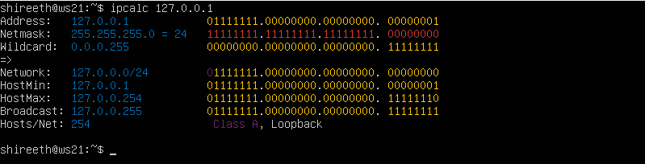<br><br>
    - 194.34.23.100 - NO,
    - 127.0.0.2 - YES (within the 127.0.0.0/8 range),
    - 127.1.0.1 - NO,
    - 128.0.0.1 - NO.<br><br>
    - (* How it works: The operating system kernel recognizes any IP starting with 127 as a loopback address.<br> It immediately routes the network traffic back to the same machine without ever sending the packet to a physical or virtual network card.)

#### 1.3. Network ranges and segments
- 1) which of the listed IPs can be used as public and which only as private:<br><br>   
    - 10.0.0.45 - private (Class A private range 10.0.0.0/8), 
    - 134.43.0.2 - public, 
    - 192.168.4.2 - private (Class C private range 192.168.0.0/16),
    - 172.20.250.4 - private (Class B private range 172.16.0.0/12),
    - 172.0.2.1 - public,
    - 192.172.0.1 - public,
    - 172.68.0.2 - public,
    - 172.16.255.255 - private (Class B private range (172.16 – 172.31)),
    - 10.10.10.10 - private (Class A private range 10.0.0.0/8),
    - 192.169.168.1 - public. <br>
    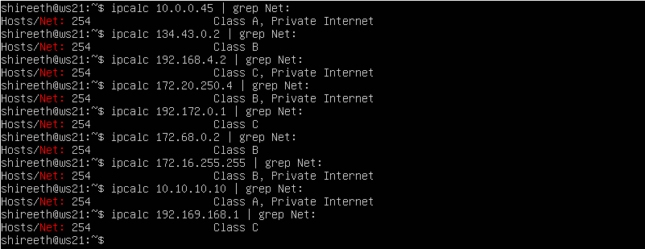<br><br>
-  2) which of the listed gateway IP addresses are possible for 10.10.0.0/18 network:<br><br>
    - 10.0.0.1 - NO,
    - 10.10.0.2 - YES (10.10.0.1 – 10.10.63.254),
    - 10.10.10.10 - YES (10.10.0.1 – 10.10.63.254),
    - 10.10.100.1 - NO,
    - 10.10.1.255- YES (10.10.0.1 – 10.10.63.254).


## Part 2. Static routing between two machines

#### 2.0 Network after cloning VM
#### View existing network interfaces with the `ip a` command.
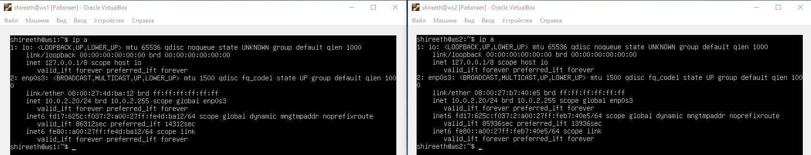<br><br>
- if no enp0s8 -> add new network via virtualbox -> settings -> net -> Adapter 2
- same Adapter 2 (intnet) for ws1 and ws2
#### Describe the network interface corresponding to the internal network on both machines and set the following addresses and masks:<br> ws1 — *192.168.100.10*, mask */16 *, ws2 — *172.24.116.8*, mask */12*
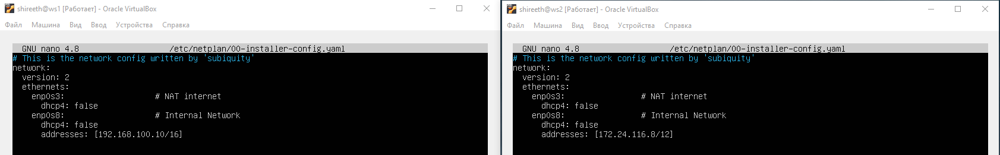<br><br>

#### Run the `netplan apply` command to restart the network service
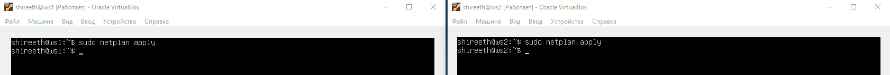<br><br>

#### 2.1. Adding a static route manually
#### Add a static route from one machine to another and back using a `ip r add` command.
#### Ping the connection between the machines
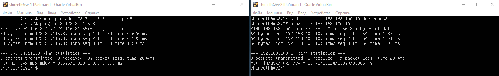<br><br>

#### 2.2. Adding a static route with saving
#### Restart the machines
#### Add static route from one machine to another using */etc/netplan/00-installer-config.yaml* file
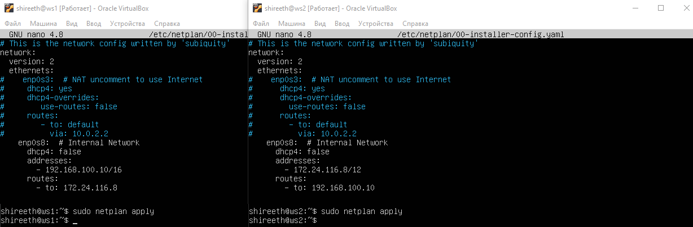<br><br>
- reboot
#### Ping the connection between the machines
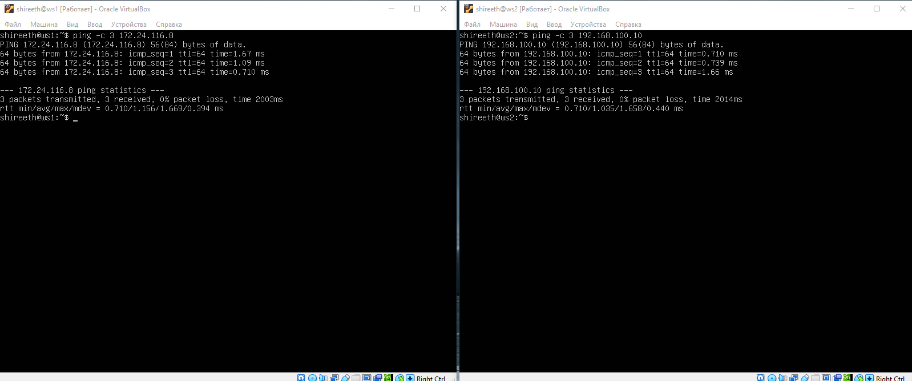<br><br>

## Part 3. **iperf3** utility

"Now that we have linked two machines, tell me: what is the most important thing about transferring information between machines?"<br>
"The connection speed?"<br>
"That's right. We’ll check it with **iperf3** utility."<br><br>
- fix internet (enp0s3) to download iperf3
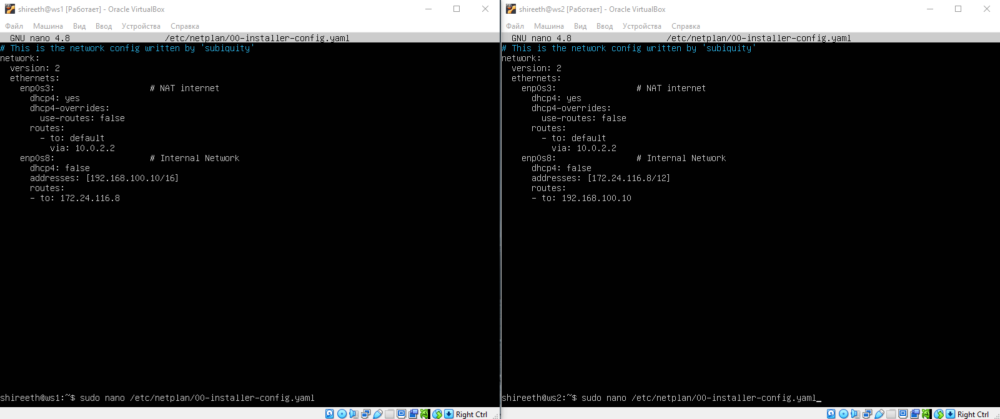<br><br>

#### 3.1. Connection speed
#### Convert and write results in the report: 8 Mbps to MB/s, 100 MB/s to Kbps, 1 Gbps to Mbps
- 8 Mbps = 1 MB/s
- 100 MB/s = 800 000 Kbps
- 1 Gbps = 1 000 Mbps

#### 3.2. **iperf3** utility
#### Measure connection speed between ws1 and ws2
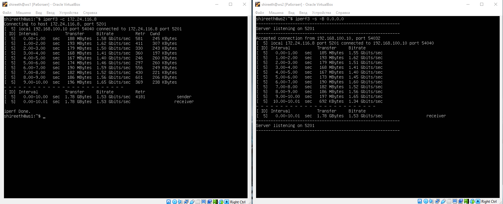<br><br>
- (if iperf3 -s dont work - use sudo ufw disable on ws2)

#### 4.1. **iptables** utility
#### Create a */etc/firewall.sh* file simulating the firewall on ws1 and ws2:
```shell
#!/bin/sh

# Deleting all the rules in the "filter" table (default).
iptables -F
iptables -X
```
#### The following rules should be added to the file in a row:
- 1) on ws1 apply a strategy where a deny rule is written at the beginning and an allow rule is written at the end (this applies to points 4 and 5);
- 2) on ws2 apply a strategy where an allow rule is written at the beginning and a deny rule is written at the end (this applies to points 4 and 5);
- 3) open access on machines for port 22 (ssh) and port 80 (http);
- 4) reject *echo reply* (machine must not ping, i.e. there must be a lock on OUTPUT);
- 5) allow *echo reply* (machine must be pinged);<br><br>
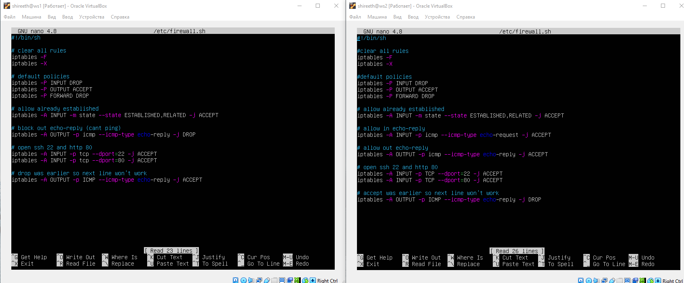<br><br>
#### Run the files on both machines with `chmod +x /etc/firewall.sh` and `/etc/firewall.sh` commands.
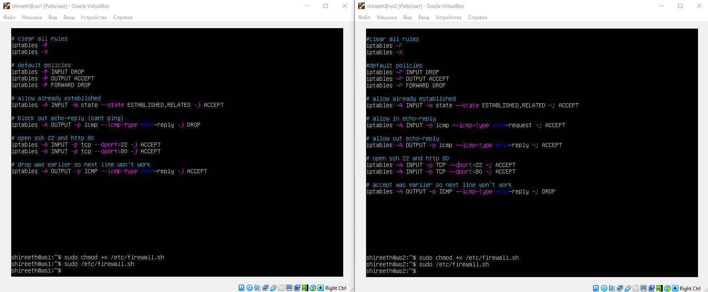<br><br>
- Once rules are added, modifying an existing rule will not work.
Therefore, the script always clears the rules first (iptables -F; iptables -X) to ensure each run creates a clean configuration!

#### 4.2. **nmap** utility
#### Use **ping** command to find a machine which is not pinged, then use **nmap** utility to show that the machine host is up
*Check: nmap output should say: `Host is up`*.
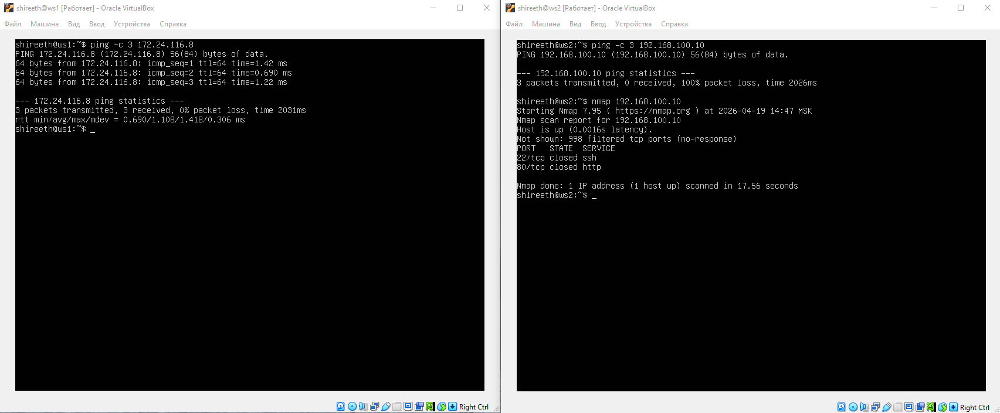<br><br>

#### 5.1. Configuration of machine addresses

#### Start five virtual machines (3 workstations (ws11, ws21, ws22) and 2 routers (r1, r2))
Net: \


#### Set up the machine configurations in *etc/netplan/00-installer-config.yaml* according to the network in the picture.
- Adapter 1 in VirtualBox for ws11, ws21, ws22, r1, r2 - NAT / default route (Internet)
- Adapter 2 in VirtualBox for ws11, ws21, ws22, r1 - inet_ws (chose name by yourself)
- Adapter 2 in VirtualBox for r2 - inet_router (chose name by yourself)
- Adapter 3 in VirtualBox for r1, r2 - inet_router, inet_ws

#### Restart the network service. If there are no errors, check that the machine address is correct with the `ip -4 a`command. Also ping ws22 from ws21. Similarly ping r1 from ws11.

- ws11 + r1<br><br>
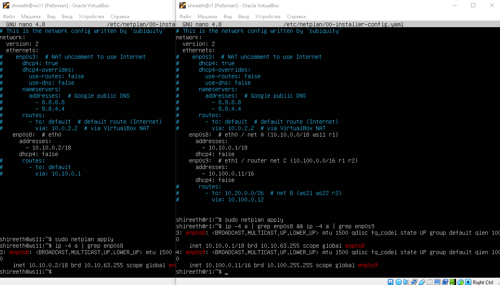<br><br>
- ws21 + ws22 + r2 <br><br>
<br><br>
- ping r1 <- ws11 (OK); r2 <- ws11 (failed)<br><br>
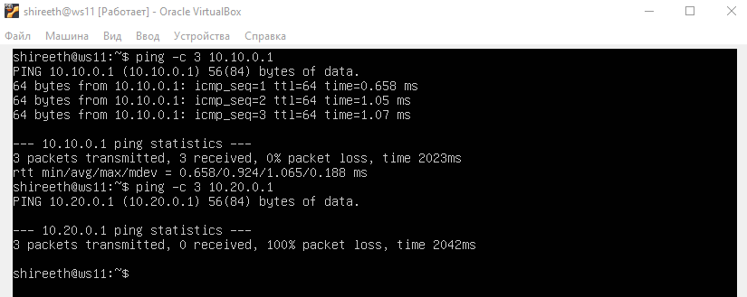<br><br>
- ping ws22 <- ws21 (OK); r2 <- ws21 (OK); r1 <- ws21 (failed)<br><br>
<br><br>


#### 5.2. Enabling IP forwarding.
#### To enable IP forwarding, run the following command on the routers:
`sysctl -w net.ipv4.ip_forward=1`.<br><br>
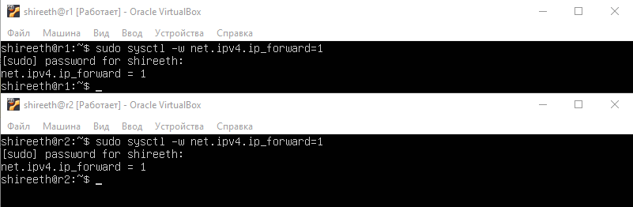<br><br>

*With this approach, the forwarding will not work after the system is rebooted.*

#### Open */etc/sysctl.conf* file and add the following line:
`net.ipv4.ip_forward = 1`
*With this approach, IP forwarding is enabled permanently.*
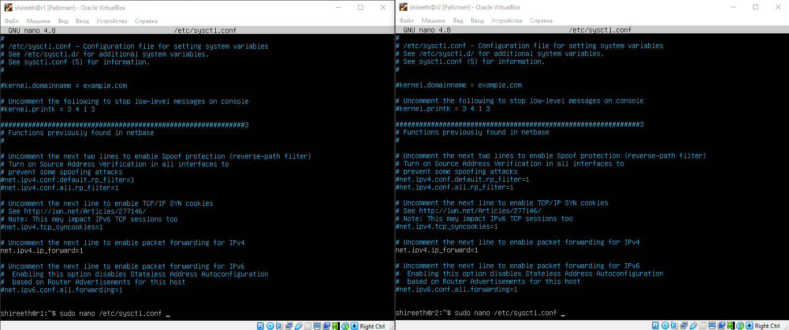<br><br>
- sudo sysctl -p

#### 5.3. Default route configuration
Here is an example of the `ip r' command output after adding a gateway:
```
default via 10.10.0.1 dev eth0
10.10.0.0/18 dev eth0 proto kernel scope link src 10.10.0.2
```
#### Configure the default route (gateway) for the workstations. To do this, add `default` before the router's IP in the configuration file
#### Call `ip r` and show that a route is added to the routing table
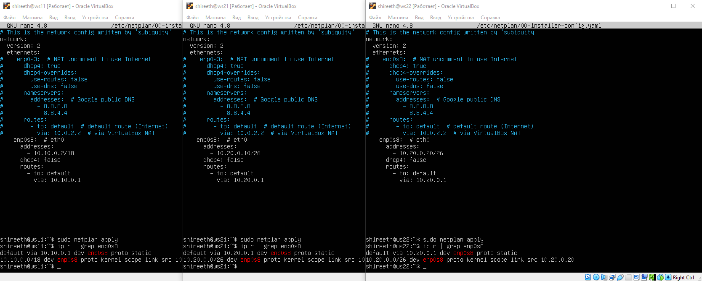<br><br>

#### Ping r2 router from ws11 and show on r2 that the ping is reaching. To do this, use the `tcpdump -tn -i eth0`
command.
- r2 -> ws 11<br><br>
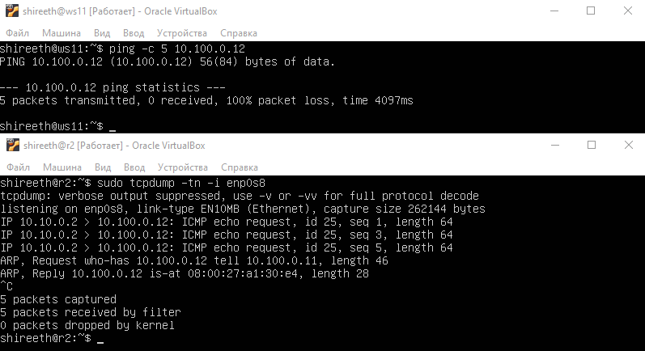<br><br>

When pinging from ws11 (10.10.0.2) to r2 (10.100.0.12), ICMP echo request packets successfully reach r2, as evidenced by the tcpdump output.<br>
 An ARP request from r1 to r2 and an ARP reply from r2 are also visible.<br>
 However, there are no echo replies because r2 does not have a reverse static route configured to the 10.10.0.0/18 network.<br>
 This confirms the need to add static routes in the next step.

#### 5.4. Adding static routes
#### Add static routes to r1 and r2 in configuration file. Here is an example for r1 route to 10.20.0.0/26:
```shell
# Add description to the end of the eth1 network interface:
- to: 10.20.0.0
  via: 10.100.0.12
```
#### Call `ip r` and show route tables on both routers. Here is an example of the r1 table:
```
10.100.0.0/16 dev eth1 proto kernel scope link src 10.100.0.11
10.20.0.0/26 via 10.100.0.12 dev eth1
10.10.0.0/18 dev eth0 proto kernel scope link src 10.10.0.1
```
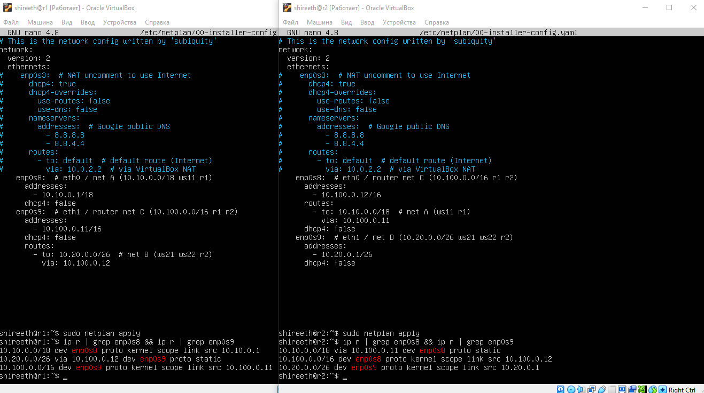<br><br>
- ping r2 <- ws11 (OK); ws21 <- ws11 (OK); ws22 <- ws11 (OK)<br><br>
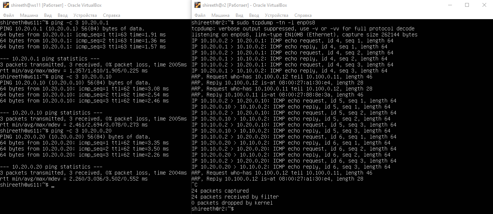<br><br>

#### Run `ip r list 10.10.0.0/[netmask]` and `ip r list 0.0.0.0/0` commands on ws11.
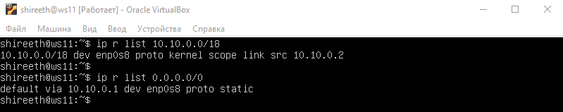<br><br>
- Explain in the report why a different route other than 0.0.0.0/0 had been selected for 10.10.0.0/\[netmask\] although it could be the default route.
- The route to 10.10.0.0/18 is chosen because explicit routes to specific subnets have higher priority than the default route (0.0.0.0/0).

#### 5.5. Making a router list
Here is an example of the **traceroute** utility output after adding a gateway:
```
1 10.10.0.1 0 ms 1 ms 0 ms
2 10.100.0.12 1 ms 0 ms 1 ms
3 10.20.0.10 12 ms 1 ms 3 ms
```
#### Run the `tcpdump -tnv -i eth0` dump command on r1
#### Use **traceroute** utility to list routers in the path from ws11 to ws21
- r1: tcpdump -tnv -i enp0s8<br><br>
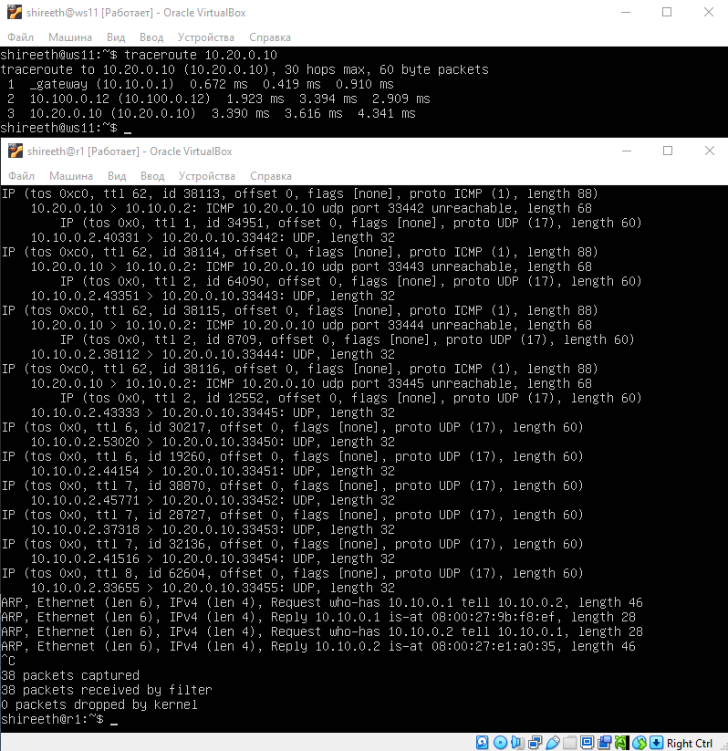<br><br>
- (ws11: traceroute 10.20.0.10<br>r1: sudo tcpdump -tnv -i enp0s8 -w file.pcap)<br><br>
Traceroute determines the path of a packet from the sender to the receiver.<br>
It sends packets with sequentially increasing TTL (1, 2, 3, etc.). <br>
Each router decrements the TTL by 1; if TTL=0, it discards the packet and returns a "Time Exceeded" message.<br>
Traceroute records the IP address of this router. The process is repeated until the packet reaches the final node.<br>
The result is a list of all intermediate routers and the latency to each.<br><br>
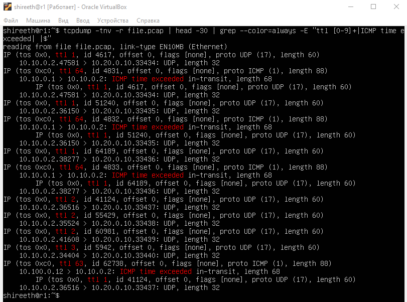<br><br>
- (ws11: traceroute -I -n 10.20.0.10<br>r1: sudo tcpdump -tnv -i any -w full_trace.pcap)<br><br>
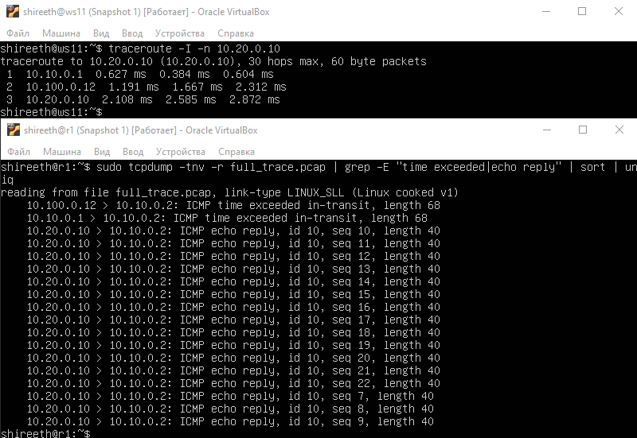<br><br>
1. 10.100.0.12 time exceeded ← router
2. 10.10.0.1 time exceeded ← router
3. 10.20.0.10 echo reply ← end node


#### 5.6. Using **ICMP** protocol in routing
#### Run on r1 network traffic capture going through eth0 with the `tcpdump -n -i eth0 icmp` command.

#### Ping a non-existent IP (e.g. *10.30.0.111*) from ws11 with the `ping -c 1 10.30.0.111` command.
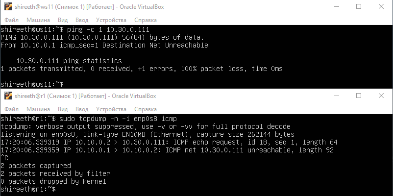<br><br>

## Part 6. Dynamic IP configuration using **DHCP**

#### For r2, configure the **DHCP** service in the */etc/dhcp/dhcpd.conf* file:

#### 1) Specify the default router address, DNS-server and internal network address. Here is an example of a file for r2:
```shell
subnet 10.100.0.0 netmask 255.255.0.0 {}

subnet 10.20.0.0 netmask 255.255.255.192
{
    range 10.20.0.2 10.20.0.50;
    option routers 10.20.0.1;
    option domain-name-servers 10.20.0.1;
}
```
#### 2) Write `nameserver 8.8.8.8` in a *resolv.conf* file
- Add screenshots of the changed files to the report.
#### Restart the **DHCP** service with `systemctl restart isc-dhcp-server`. Reboot the ws21 machine with `reboot` and show with `ip a` that it has got an address. Also ping ws22 from ws21.
- Add a screenshot with the call and the output of the used commands to the report.

#### Specify MAC address at ws11 by adding to *etc/netplan/00-installer-config.yaml*:
`macaddress: 10:10:10:10:10:BA`, `dhcp4: true`
- Add a screenshot of the changed *etc/netplan/00-installer-config.yaml* file to the report.
#### Сonfigure r1 the same way as r2, but make the assignment of addresses strictly linked to the MAC-address (ws11). Run the same tests
- Describe this part in the report the same way as for r2.
#### Request IP address update from ws21
- Add screenshots of IP before and after update to the report;
- Describe in the report what **DHCP** server options were used in this point.