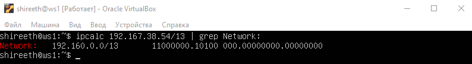
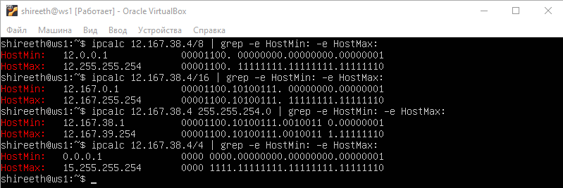

## Part 1. ipcalc tool

#### 1.1. Networks and Masks
- 1) network address of 192.167.38.54/13  
    - 192.160.0.0  
      
- 2) conversion of the mask 255.255.255.0 to prefix and binary, /15 to normal and binary, 11111111.11111111.11111111.11110000 to normal and prefix  
        - 255.255.255.0 to prefix(CIDR) = /24  
        - 255.255.255.0 to binary = 11111111.11111111.11111111.00000000  
          
        - /15 to normal (dotted decimal) = 255.254.0.0  
        - /15 to binary = 11111111.11111110.00000000.00000000  
          
        - 11111111.11111111.11111111.11110000 to normal (dotted decimal) = 255.255.255.240  
        - 11111111.11111111.11111111.11110000 to prefix(CIDR) = /28  
          
- 3) minimum and maximum host in 12.167.38.4 network with masks: /8, 11111111.11111111.00000000.00000000, 255.255.254.0 and /4  
      

#### 1.2. localhost
-  Define and write in the report whether an application running on localhost can be accessed with the following IPs:  

    - 194.34.23.100 - NO,
    - 127.0.0.2 - YES (within the 127.0.0.0/8 range),
    - 127.1.0.1 - YES (within the 127.0.0.0/8 range),
    - 128.0.0.1 - NO.  
    - (* How it works: The operating system kernel recognizes any IP starting with 127 as a loopback address.  It immediately routes the network traffic back to the same machine without ever sending the packet to a physical or virtual network card.)

#### 1.3. Network ranges and segments
- 1) which of the listed IPs can be used as public and which only as private:  
    - 10.0.0.45, 
    - 134.43.0.2, 
    - 192.168.4.2,
    - 172.20.250.4,
    - 172.0.2.1,
    - 192.172.0.1,
    - 172.68.0.2,
    - 172.16.255.255,
    - 10.10.10.10,
    - 192.169.168.1  
-  2) which of the listed gateway IP addresses are possible for 10.10.0.0/18 network:  
    - 10.0.0.1,
    - 10.10.0.2,
    - 10.10.10.10,
    - 10.10.100.1,
    - 10.10.1.255

